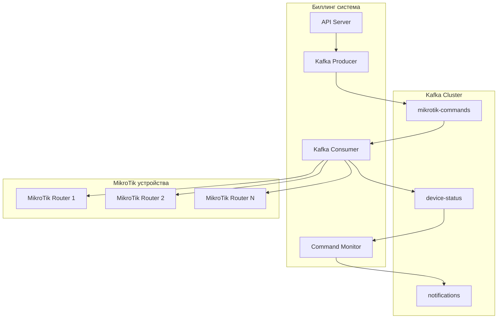

# Kafka интеграция для MikroTik

## Обзор

Система использует Apache Kafka для асинхронной обработки команд управления MikroTik устройствами. Это обеспечивает надежность, масштабируемость и отказоустойчивость при работе с сетевым оборудованием.

## Архитектура



## Топики Kafka

### 1. mikrotik-commands
**Назначение**: Команды для выполнения на MikroTik устройствах

**Структура сообщения**:
```typescript
interface MikroTikCommand {
  type: 'ADD_DHCP' | 'REMOVE_DHCP' | 'BLOCK_CLIENT' | 'UNBLOCK_CLIENT' | 'GET_STATS';
  deviceId: string;
  accountId: string;
  macAddress: string;
  ipAddress?: string;
  poolName?: string;
  timestamp: number;
}
```

**Примеры команд**:
```json
{
  "type": "ADD_DHCP",
  "deviceId": "device-123",
  "accountId": "account-456",
  "macAddress": "00:11:22:33:44:55",
  "ipAddress": "192.168.1.100",
  "poolName": "dhcp-pool",
  "timestamp": 1703123456789
}
```

### 2. device-status
**Назначение**: Результаты выполнения команд на устройствах

**Структура сообщения**:
```typescript
interface MikroTikCommandResult {
  commandId: string;
  deviceId: string;
  success: boolean;
  result?: any;
  error?: string;
  timestamp: number;
}
```

### 3. notifications
**Назначение**: Уведомления о завершении команд и системных событиях

## Компоненты системы

### 1. MikroTikKafkaConsumer

**Файл**: `packages/app-server/src/modules/devices/kafka.consumer.ts`

**Функции**:
- Подписка на топик `mikrotik-commands`
- Обработка команд MikroTik
- Отправка результатов в топик `device-status`
- Интеграция с CommandMonitorService

**Поддерживаемые команды**:

#### ADD_DHCP
Добавление DHCP lease для клиента
```typescript
{
  type: 'ADD_DHCP',
  deviceId: 'device-id',
  accountId: 'account-id',
  macAddress: '00:11:22:33:44:55',
  ipAddress: '192.168.1.100',
  poolName: 'dhcp-pool'
}
```

#### REMOVE_DHCP
Удаление DHCP lease клиента
```typescript
{
  type: 'REMOVE_DHCP',
  deviceId: 'device-id',
  accountId: 'account-id',
  macAddress: '00:11:22:33:44:55'
}
```

#### BLOCK_CLIENT
Блокировка клиента (несколько методов)
```typescript
{
  type: 'BLOCK_CLIENT',
  deviceId: 'device-id',
  accountId: 'account-id',
  macAddress: '00:11:22:33:44:55'
}
```

#### UNBLOCK_CLIENT
Разблокировка клиента
```typescript
{
  type: 'UNBLOCK_CLIENT',
  deviceId: 'device-id',
  accountId: 'account-id',
  macAddress: '00:11:22:33:44:55'
}
```

#### GET_STATS
Получение статистики клиента
```typescript
{
  type: 'GET_STATS',
  deviceId: 'device-id',
  accountId: 'account-id',
  macAddress: '00:11:22:33:44:55'
}
```

### 2. CommandMonitorService

**Файл**: `packages/app-server/src/modules/devices/command-monitor.service.ts`

**Функции**:
- Мониторинг выполнения команд
- Обработка таймаутов
- Повторные попытки при неудаче
- Сохранение результатов в базу данных
- Отправка уведомлений

**Статусы команд**:
- `pending` - Команда ожидает выполнения
- `processing` - Команда выполняется
- `completed` - Команда выполнена успешно
- `failed` - Команда завершилась с ошибкой
- `timeout` - Превышено время ожидания

### 3. MikroTikService

**Файл**: `packages/app-server/src/modules/devices/mikrotik.service.ts`

**Функции**:
- Взаимодействие с MikroTik API
- Проверка доступности устройств
- Выполнение команд на устройствах
- Обработка различных методов блокировки

**Методы блокировки**:
1. **Address List** - Добавление IP в список заблокированных
2. **Firewall Filter** - Создание правила блокировки по MAC

## API эндпоинты

### Отправка команды
```http
POST /api/devices/commands
Content-Type: application/json

{
  "deviceId": "device-123",
  "accountId": "account-456",
  "type": "BLOCK_CLIENT",
  "macAddress": "00:11:22:33:44:55"
}
```

### Статус команды
```http
GET /api/devices/commands/{commandId}
```

### Активные команды
```http
GET /api/devices/commands/active
```

### Статистика команд
```http
GET /api/devices/commands/stats
```

## Конфигурация

### Переменные окружения
```bash
# Kafka настройки
KAFKA_BROKERS=localhost:29092
KAFKA_CLIENT_ID=app-server-dev
KAFKA_GROUP_ID=app-server-group-dev

# MikroTik настройки
MIKROTIK_DEFAULT_PORT=8728
MIKROTIK_DEFAULT_TIMEOUT=10000
MIKROTIK_HEALTH_CHECK_INTERVAL=300000
MIKROTIK_MAX_RETRIES=3
MIKROTIK_RETRY_DELAY=5000
```

### Конфигурация в коде
```typescript
// packages/app-server/src/config/config.ts
kafka: {
  brokers: process.env.KAFKA_BROKERS?.split(',') || ['localhost:29092'],
  clientId: process.env.KAFKA_CLIENT_ID || 'app-server',
  groupId: process.env.KAFKA_GROUP_ID || 'billing-group',
  topics: {
    mikrotikCommands: 'mikrotik-commands',
    deviceStatus: 'device-status',
    notifications: 'notifications',
  },
},

mikrotik: {
  defaultPort: parseInt(process.env.MIKROTIK_DEFAULT_PORT || '8728', 10),
  defaultTimeout: parseInt(process.env.MIKROTIK_DEFAULT_TIMEOUT || '10000', 10),
  healthCheckInterval: parseInt(process.env.MIKROTIK_HEALTH_CHECK_INTERVAL || '300000', 10),
  maxRetries: parseInt(process.env.MIKROTIK_MAX_RETRIES || '3', 10),
  retryDelay: parseInt(process.env.MIKROTIK_RETRY_DELAY || '5000', 10),
}
```

## Мониторинг и логирование

### Логи системы
Все операции логируются с соответствующими эмодзи для удобства:
- 🎯 Запуск consumer'а
- 🔧 Обработка команды
- ✅ Успешное выполнение
- ❌ Ошибки
- 📤 Отправка сообщений
- 📥 Получение сообщений
- 🔄 Повторные попытки
- ⏰ Таймауты

### Метрики для мониторинга
- Количество обработанных команд
- Время выполнения команд
- Процент успешных операций
- Количество повторных попыток
- Статус устройств

## Обработка ошибок

### Типы ошибок
1. **Сетевые ошибки** - Устройство недоступно
2. **Ошибки аутентификации** - Неверные учетные данные
3. **Ошибки API** - Некорректные параметры команды
4. **Таймауты** - Превышено время ожидания

### Стратегии восстановления
1. **Автоматические повторы** - До 3 попыток с задержкой
2. **Graceful degradation** - Система продолжает работать при недоступности Kafka
3. **Fallback механизмы** - Альтернативные методы блокировки

## Тестирование

### Unit тесты
```bash
cd packages/app-server
yarn test src/modules/devices/__tests__/kafka-integration.test.ts
```

### Integration тесты
Тесты проверяют:
- Отправку и получение сообщений Kafka
- Обработку различных типов команд
- Мониторинг статуса команд
- Обработку ошибок и таймаутов

### Тестирование в Docker
```bash
# Запуск Kafka в Docker
docker-compose up -d kafka

# Запуск тестов
yarn test:integration
```

## Производительность

### Оптимизации
1. **Batch processing** - Группировка команд для обработки
2. **Connection pooling** - Переиспользование соединений
3. **Async processing** - Неблокирующая обработка команд
4. **Caching** - Кеширование результатов проверок устройств

### Масштабирование
- Горизонтальное масштабирование consumer'ов
- Партиционирование топиков по устройствам
- Load balancing между экземплярами

## Безопасность

### Аутентификация
- Шифрование паролей устройств
- Безопасное хранение учетных данных
- Ротация ключей доступа

### Авторизация
- Проверка прав доступа к устройствам
- Аудит выполненных команд
- Ограничение типов команд по ролям

## Troubleshooting

### Частые проблемы

#### Kafka недоступен
```bash
# Проверка статуса Kafka
docker-compose ps kafka

# Просмотр логов
docker-compose logs kafka
```

#### Устройство не отвечает
```bash
# Проверка доступности
ping 192.168.1.1

# Проверка API
curl -X GET http://192.168.1.1/rest/system/identity
```

#### Команды не выполняются
1. Проверить статус Kafka consumer'а
2. Проверить логи приложения
3. Проверить доступность устройств
4. Проверить учетные данные

### Диагностические команды
```bash
# Статус всех сервисов
curl http://localhost:3001/health

# Статистика команд
curl http://localhost:3001/api/devices/commands/stats

# Активные команды
curl http://localhost:3001/api/devices/commands/active
```

## Развитие системы

### Планируемые улучшения
1. **Batch операции** - Групповая обработка команд
2. **Priority queues** - Приоритизация команд
3. **Dead letter queues** - Обработка неудачных сообщений
4. **Metrics collection** - Сбор детальных метрик
5. **Real-time monitoring** - Мониторинг в реальном времени

### Интеграции
- Zabbix мониторинг
- Grafana дашборды
- Telegram уведомления
- Email алерты